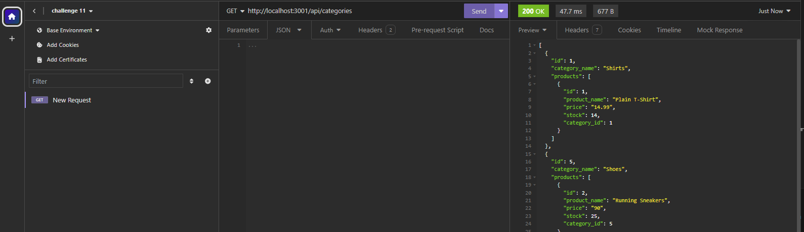
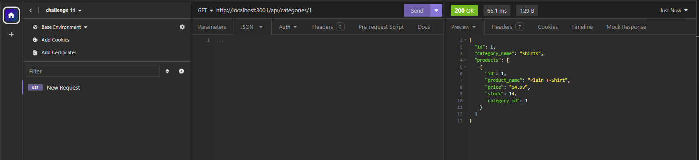
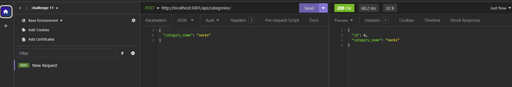
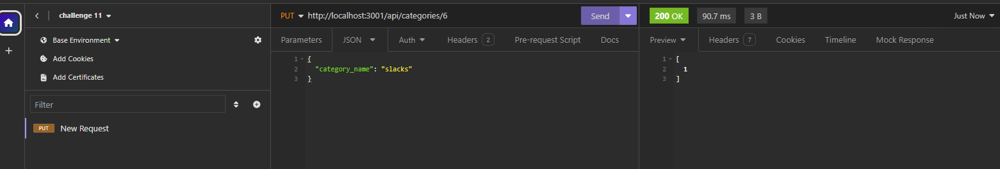
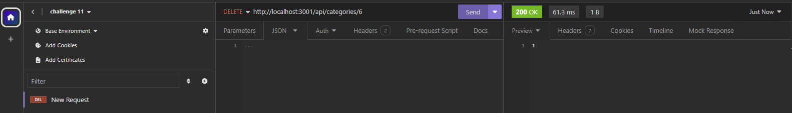

# 10-employee-tracker

  

## Description
The eleventh challenge assignment from a bootcamp where the task was to build the back end for an e-commerce site by modifying starter code. The task includes configuring a working Express.js API to use Sequlize to interact with a PostgreSQL database.

## Table of Content
-[Description](#Description)
-[Process](#Process)
-[Links](#Links)
-[Installation](#Installation)
-[Usage](#Usage)
-[Licenses](#Licenses)
-[Contribution](#Contribution)
-[Test](#Test)
-[Acknowledgement](#Acknowledgement)
-[Questions](#Questions)

## Process
The process included importing an instance of sequlize into the server.js file and syncing to the sequlize connection before listening to server. A new environment variable was created for my local machine. The data that was needed to be added to the starter code are the models and routes. For each model of Category, Product, ProductTag, and Tag, parameters were added for the id and associated data. This included specifying datatypes and primary keys. The index.js file in the models folder specifies the relationships between the models. The routes for each model were created for the get, post, put, and delete routes. In each route, a try/catch block was included as well as a conditional if there was no data, an error message will pop up. Additionally, async and await was used for the asynchronous requests and status codes were used for successfully request or an error.

## Links
Link to walkthrough: https://drive.google.com/file/d/1iAVGIvV1pktKN8_vcN25-r3CKHmlQeI8/view

## Installation
To install this application, copy the ssh key from my github repo and clone it into your respository. Do an npm install. Run the schema file as well as the command 'npm run seed' to seed the database. Then, 'npm start', to start the server.

## Usage
This site was a practice assignment for bootcamp students but can be used to see how an application made by MySQL works. 

## Licenses
This repository is using the [MIT](https://opensource.org/licenses/MIT) license.

## Contribution
Contact me by email provided in Questions section.

## Test
To test this application, simply open the applcation in VScode and Insomnia to try it out.

## Acknowledgement
Project was done by the knowledge learned from bootcamp instructor John.

## Questions
Contact with questions at:

Email: mackenzielmoore14@gmail.com
Click [here](https://github.com/mackemo) for Github account.